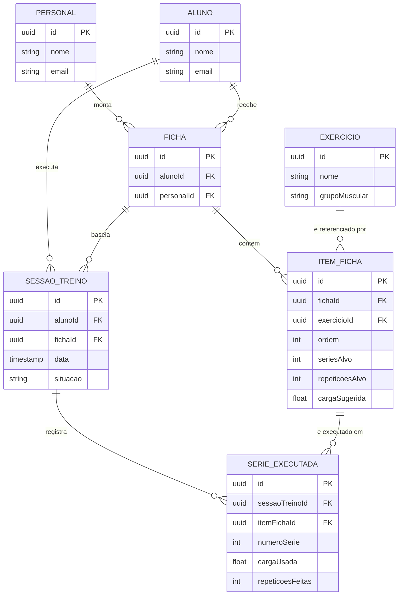
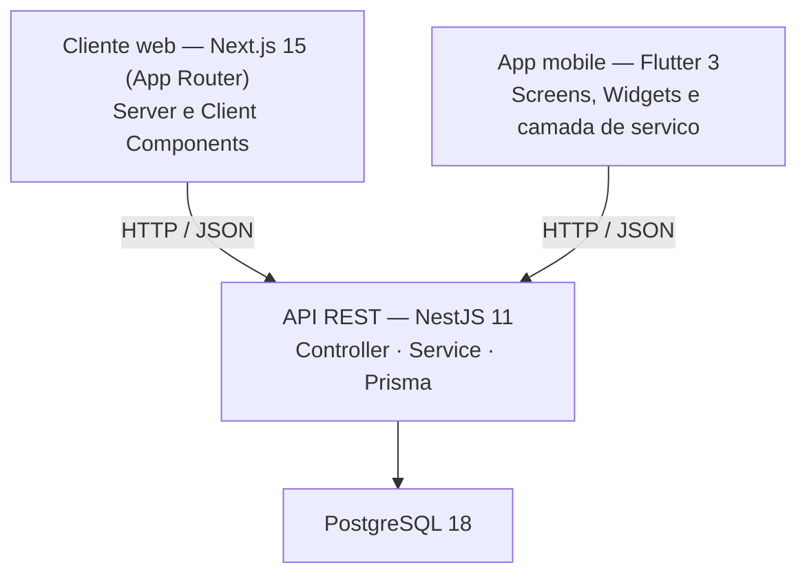

# PRD — Product Requirements Document

> O contrato da API vive em documento separado: [`docs/contrato-api.md`](contrato-api.md). Este PRD define **o que** o sistema faz; o contrato define **como** os clientes conversam com ele.

---

## Identificação

| Campo | Valor |
|---|---|
| **Nome do projeto** | Treino Progressivo |
| **Grupo** | 2 |
| **Versão do documento** | 1.0 |
| **Data de criação** | 2026-09-12 |
| **Última atualização** | 2026-09-12 |
| **Documento de Visão (ref.)** | `docs/visao.md` |
| **Contrato da API (ref.)** | `docs/contrato-api.md` |

---

## 1. Objetivo do produto

O Treino Progressivo permite que um personal trainer monte fichas de treino para seus alunos e acompanhe a evolução de carga de cada exercício ao longo do tempo, enquanto o aluno executa o treino do dia e registra o que fez direto do celular na academia. O sistema calcula automaticamente a sobrecarga progressiva — o quanto a carga sugerida deve subir, manter ou cair na próxima sessão — a partir do desempenho registrado, eliminando o controle manual em planilha ou papel.

---

## 2. Personas

### Persona 1 — Fernanda

- **Contexto:** personal trainer autônoma, atende cerca de 15 alunos, planeja as fichas em casa ou no escritório, sentada, com tempo para revisar dados.
- **Cliente principal:** web
- **Objetivo principal no sistema:** montar fichas de treino consistentes e enxergar se um aluno está evoluindo de carga ou estagnado, sem precisar cruzar planilhas.
- **Maior frustração atual (sem o sistema):** perde o histórico de carga dos alunos em anotações soltas e decide o ajuste de carga "no chute" a cada novo ciclo.
- **Critério de sucesso:** consegue montar uma ficha nova em poucos minutos e ver a evolução de carga de um aluno em um exercício específico sem perguntar a ele.

### Persona 2 — Marcos

- **Contexto:** aluno, treina na academia, com o celular em mãos entre uma série e outra, sem tempo nem paciência para preencher formulários longos.
- **Cliente principal:** mobile
- **Objetivo principal no sistema:** saber o treino do dia e registrar rapidamente carga e repetições de cada série, sem precisar lembrar disso depois em casa.
- **Maior frustração atual (sem o sistema):** esquece a carga usada na última vez e acaba repetindo ou reduzindo o peso sem perceber que já tinha evoluído.
- **Critério de sucesso:** abre o app, vê o treino do dia com a carga sugerida já calculada, e registra cada série em poucos toques.

---

## 3. Requisitos funcionais

### 3.1 Autenticação e sessão

| ID | Descrição | Prioridade | Persona | Cliente |
|---|---|---|---|---|
| RF-001 | O usuário entra no sistema informando e-mail e senha e recebe acesso às funcionalidades do seu perfil (`personal` ou `aluno`) | Alta | todas | web / mobile |
| RF-002 | O usuário encerra a sessão e deixa de ter acesso às rotas protegidas | Alta | todas | web / mobile |
| RF-003 | Não há auto-cadastro: a conta do personal nasce de seed do banco; o personal cadastra a conta de cada aluno (RF-021) | Alta | Fernanda | web |

### 3.2 Catálogo de exercícios

| ID | Descrição | Prioridade | Persona | Cliente |
|---|---|---|---|---|
| RF-010 | O personal cadastra um exercício no catálogo, com nome e grupo muscular | Alta | Fernanda | web |
| RF-011 | O personal edita ou remove um exercício do catálogo | Média | Fernanda | web |
| RF-012 | Qualquer usuário autenticado consulta o catálogo de exercícios | Alta | Fernanda, Marcos | web / mobile |

### 3.3 Gestão de alunos

| ID | Descrição | Prioridade | Persona | Cliente |
|---|---|---|---|---|
| RF-020 | O personal lista os próprios alunos | Alta | Fernanda | web |
| RF-021 | O personal cadastra um novo aluno, definindo uma senha provisória | Alta | Fernanda | web |
| RF-022 | O personal edita os dados de um aluno | Baixa | Fernanda | web |

### 3.4 Fichas de treino

| ID | Descrição | Prioridade | Persona | Cliente |
|---|---|---|---|---|
| RF-030 | O personal monta uma ficha para um aluno, com uma lista ordenada de exercícios, cada um com séries-alvo, repetições-alvo e carga sugerida inicial | Alta | Fernanda | web |
| RF-031 | O personal edita a ficha de um aluno, adicionando, removendo ou ajustando itens | Média | Fernanda | web |
| RF-032 | O aluno consulta a própria ficha ativa | Alta | Marcos | mobile |

### 3.5 Execução de treino

| ID | Descrição | Prioridade | Persona | Cliente |
|---|---|---|---|---|
| RF-040 | O aluno inicia uma sessão de treino a partir da própria ficha | Alta | Marcos | mobile |
| RF-041 | O aluno registra carga usada e repetições feitas em cada série de cada exercício da sessão | Alta | Marcos | mobile |
| RF-042 | O aluno finaliza a sessão, e o sistema recalcula automaticamente a carga sugerida de cada exercício para a próxima vez | Alta | Marcos | mobile |

### 3.6 Evolução e acompanhamento

| ID | Descrição | Prioridade | Persona | Cliente |
|---|---|---|---|---|
| RF-050 | O personal consulta a evolução de carga de um aluno em um exercício específico, ao longo do tempo | Média | Fernanda | web |
| RF-051 | O aluno consulta o histórico das últimas sessões realizadas | Baixa | Marcos | mobile |

---

## 4. Requisitos não funcionais

| ID | Categoria | Descrição | Critério de aceitação |
|---|---|---|---|
| RNF-001 | Segurança — credenciais | Senhas são armazenadas com hash e nunca em texto puro | Nenhuma senha legível no banco; a coluna guarda o hash |
| RNF-002 | Segurança — sessão | O acesso é feito por token JWT, com validade definida | Token expirado é recusado com `401` |
| RNF-003 | Segurança — rotas | Toda rota que não seja pública exige token válido | Requisição sem token recebe `401`; requisição com perfil insuficiente recebe `403` |
| RNF-004 | Segurança — segredos | Chaves e credenciais ficam em variável de ambiente | Nenhum segredo versionado no repositório |
| RNF-005 | Desempenho | Registrar uma série executada responde rápido o suficiente para não quebrar o ritmo do treino | `POST /sessoes-treino/:id/series` responde em menos de 1s em ambiente de desenvolvimento |
| RNF-006 | Usabilidade (mobile) | Registrar uma série exige o mínimo de toques possível, pensando em uso com uma mão só entre séries | Registrar carga e repetições de uma série leva no máximo 2 toques após abrir a sessão |
| RNF-007 | Manutenibilidade | Regra de sobrecarga progressiva concentrada em um único ponto do backend | Nenhuma lógica de cálculo de carga duplicada em `web/` ou `mobile/` |
| RNF-008 | Comportamento em rede instável (mobile) | O app não perde os dados de séries já preenchidas se a conexão cair no meio do treino | Ao perder conexão após preencher uma série, o app mantém o valor em tela e permite reenviar quando a rede voltar |
| RNF-009 | Consistência entre clientes | Um dado criado em um cliente aparece corretamente no outro sem transformação adicional | Uma ficha criada no web é exibida com os mesmos valores no mobile |

---

## 5. Regras de negócio

| ID | Regra | Validação antecipada no cliente? |
|---|---|---|
| RN-001 | Ao finalizar uma sessão, a carga sugerida de cada item é recalculada: sobe 5% se o aluno completou a repetição-alvo em todas as séries do item, mantém se completou em parte delas, e reduz 5% se ficou abaixo do alvo em mais de uma série | não |
| RN-002 | Um aluno não pode ter duas sessões `em_andamento` simultâneas para a mesma ficha | não |
| RN-003 | Um item de ficha não pode ser removido depois de ter alguma série executada registrada contra ele — o histórico não pode ser perdido | sim, o app pode ocultar a opção de remover, mas o backend é quem recusa com `409` |
| RN-004 | Uma sessão finalizada não aceita novas séries nem pode ser finalizada de novo | sim, o app trava os campos após finalizar, mas o backend é a fonte da verdade |

**Autorização — quem pode o quê.** A tabela completa vive em `docs/contrato-api.md`, seção 2.3, porque é lá que ela vira `403`.

| ID | Regra de autorização | Perfil |
|---|---|---|
| RN-A01 | Um aluno só vê e altera as próprias fichas e sessões | `aluno` |
| RN-A02 | Um personal só vê e altera alunos e fichas vinculados a ele mesmo | `personal` |
| RN-A03 | Apenas o personal cadastra exercícios, alunos e fichas — o aluno nunca cria esses recursos | `personal` |

---

## 6. Modelo de dados

### 6.1 Diagrama ER

### 6.2 Descrição das entidades

| Entidade | Responsabilidade | Principais atributos |
|---|---|---|
| Personal | Profissional que monta fichas e acompanha alunos | nome, email |
| Aluno | Pessoa que treina, dona das fichas e sessões | nome, email |
| Exercicio | Item de catálogo reutilizável entre fichas | nome, grupoMuscular |
| Ficha | Prescrição de treino de um personal para um aluno | alunoId, personalId |
| ItemFicha | Um exercício dentro de uma ficha, com meta e carga sugerida | ordem, seriesAlvo, repeticoesAlvo, cargaSugerida |
| SessaoTreino | Uma execução da ficha em uma data | data, situacao |
| SerieExecutada | Registro real de uma série dentro de uma sessão | numeroSerie, cargaUsada, repeticoesFeitas |

---

## 7. Recorte web/mobile

| Funcionalidade | Web | Mobile | Justificativa |
|---|---|---|---|
| Cadastro de exercícios | ✅ | — | Tarefa de configuração, feita sentado, sem urgência de mobilidade |
| Cadastro e gestão de alunos | ✅ | — | Tarefa administrativa do personal, tela grande facilita revisão |
| Montagem e edição de fichas | ✅ | — | Requer visão de conjunto (vários exercícios, ordem, metas) que cabe melhor em tela grande |
| Consulta da ficha ativa | ✅ (personal vê a do aluno) | ✅ (aluno vê a própria) | O aluno precisa da ficha em mãos na academia; o personal revisa o que montou |
| Execução de treino (iniciar sessão, registrar série, finalizar) | — | ✅ | É o núcleo do uso em movimento, com o celular na mão entre séries — não faz sentido em uma tela de computador na academia |
| Evolução de carga por exercício (gráfico) | ✅ | — | Análise histórica, com mais espaço de tela; cortado do mobile no MVP para não competir com o fluxo rápido de execução |
| Histórico de sessões recentes | — | ✅ (versão simples, sem gráfico) | O aluno quer conferir rapidamente o que fez na última vez, sem esperar carregar um painel |

**O que ficou de fora do mobile e por quê:** cadastro de exercícios, gestão de alunos e montagem de fichas — são tarefas do personal, que usa o web; e o gráfico de evolução, que fica mais legível em tela grande e não é essencial durante o treino.

**O que ficou de fora do web e por quê:** o fluxo de execução de treino (iniciar sessão, registrar série a série) — não há cenário em que o personal execute o treino do aluno pelo navegador.

**Recorte mobile mínimo (1 a 3 casos de uso, com leitura e escrita na API):**
- Consultar a ficha ativa (leitura)
- Iniciar sessão, registrar séries executadas e finalizar a sessão (leitura e escrita — dispara o recálculo de sobrecarga progressiva)

---

## 8. Arquitetura da solução

### 8.1 Visão geral dos componentes

### 8.2 Estrutura dos três projetos

| Componente | Desvio em relação ao README | Motivo |
|---|---|---|
| Backend | nenhum | — |
| Cliente web | nenhum | — |
| App mobile | nenhum | — |

### 8.3 Módulos e recursos do backend

| Módulo | Recurso do domínio | Endpoints previstos |
|---|---|---|
| AuthModule | Login | `POST /auth/login` |
| ExerciciosModule | Exercicio | `GET/POST/PATCH/DELETE /exercicios` |
| AlunosModule | Aluno | `GET/POST/PATCH /alunos` |
| FichasModule | Ficha, ItemFicha | `GET/POST/PATCH/DELETE /fichas`, `POST /fichas/:id/itens`, `PATCH/DELETE /itens-ficha/:id` |
| SessoesTreinoModule | SessaoTreino, SerieExecutada | `GET/POST /sessoes-treino`, `POST /sessoes-treino/:id/series`, `POST /sessoes-treino/:id/finalizar` |
| AlunosModule (evolução) | consulta agregada | `GET /alunos/:alunoId/exercicios/:exercicioId/evolucao` |

### 8.4 Decisões técnicas por componente

| Componente | Decisão a tomar | Escolha do grupo | Justificativa |
|---|---|---|---|
| Backend | Estratégia de autenticação | JWT simples, sem refresh token | Validade de 8h é suficiente para o uso diário; simplifica o MVP dado o prazo |
| Backend | Formato de identificador | uuid | Já adotado no `schema.prisma` atual |
| Web | Fronteira Server / Client Components | Server Components para listagens e leitura (alunos, fichas, evolução); Client Components para formulários e login | Reduz JS enviado ao cliente nas telas de consulta, que são a maioria do uso do personal |
| Web | Estratégia de revalidação e cache | Revalidação sob demanda (`revalidatePath`) após cada mutação | Domínio transacional — dados desatualizados por cache agressivo geram decisão errada de carga |
| Mobile | Gerência de estado | `setState` | Suficiente para o recorte mínimo (ficha do dia + registro de série) |
| Mobile | Nível de autenticação e armazenamento do token | Simplificada — login real contra `/auth/login`, token mantido em memória | Reduz esforço de implementação de refresh/expiração no prazo da Etapa 4, sem abrir mão de login real |

### 8.5 Tecnologias e versões

| Tecnologia | Versão | Papel |
|---|---|---|
| Node.js | 22 LTS | Runtime do backend |
| NestJS | 11 | Framework da API |
| Prisma | 7 (com `@prisma/adapter-pg`) | ORM e migrations |
| PostgreSQL | 18 | Banco de dados |
| React | 19 | Biblioteca de interface |
| Next.js | 15 (App Router) | Framework do cliente web |
| Flutter / Dart | 3 | Framework do app mobile |
| Docker | opcional | Banco de dados local |

---

## 9. Planejamento de sprints

| Sprint | Etapa | Tema | Requisitos previstos | Responsáveis | Entregáveis |
|---|---|---|---|---|---|
| 1 | Etapa 1 | Contrato e fundação | — | ambos | PRD, contrato e backend rodando |
| 2 | Etapa 2 | Backend: catálogo, alunos e fichas | RF-010 a RF-012, RF-020 a RF-022, RF-030 a RF-032 | ambos (regra dos dois componentes) | CRUDs respondendo, sem auth ainda |
| 3 | Etapa 2 / 3 | Backend: sessão de treino e sobrecarga progressiva; início do web | RF-040 a RF-042, RN-001 a RN-004 | ambos | Endpoints do MVP completos; navegação inicial do web |
| 4 | Etapa 3 | Cliente web completo | RF-001, RF-002, RF-010, RF-011, RF-020 a RF-022, RF-030, RF-031, RF-050 | responsável web | Fluxo principal do personal navegável |
| 5 | Etapa 4 | App mobile completo | RF-001, RF-002, RF-032, RF-040 a RF-042, RF-051 | responsável mobile | Fluxo principal do aluno no emulador |
| 6 | Etapa 5 | Integração e fechamento | — | ambos | Entrega final, relatório e vídeo |

> Datas de cada sprint seguem o calendário da turma — preencher assim que publicado.

---

## 10. Critérios de aceite (MVP)

- [ ] Personal faz login, cadastra um exercício, cadastra um aluno e monta uma ficha completa para ele, tudo pelo web
- [ ] Aluno faz login no mobile e vê a ficha montada pelo personal, com os exercícios na ordem correta
- [ ] Aluno inicia uma sessão, registra série a série (carga e repetições) e finaliza — a carga sugerida do próximo treino é recalculada conforme RN-001
- [ ] Um registro criado pelo cliente web aparece corretamente no app mobile, e vice-versa
- [ ] O app apresenta um token válido à API e vê os mesmos dados do cliente web, qualquer que seja o nível de autenticação declarado
- [ ] Personal consulta a evolução de carga do aluno naquele exercício e vê o valor recém-calculado refletido

---

## 11. Fora do escopo (explícito)

- Refresh token e recuperação de senha — login simples com token de validade fixa
- Múltiplos personals por aluno, ou um aluno migrar de personal
- Notificações push para lembrar o aluno de treinar
- Parametrização do percentual de sobrecarga progressiva por personal — fica fixo em 5% no backend (RN-001)
- Edição de uma série já registrada, ou de uma sessão já finalizada
- Gráfico de evolução no app mobile — fica só no web (seção 7)

---

## 12. Histórico de revisões

| Versão | Data | Descrição |
|---|---|---|
| 1.0 | 2026-09-12 | Versão inicial |
